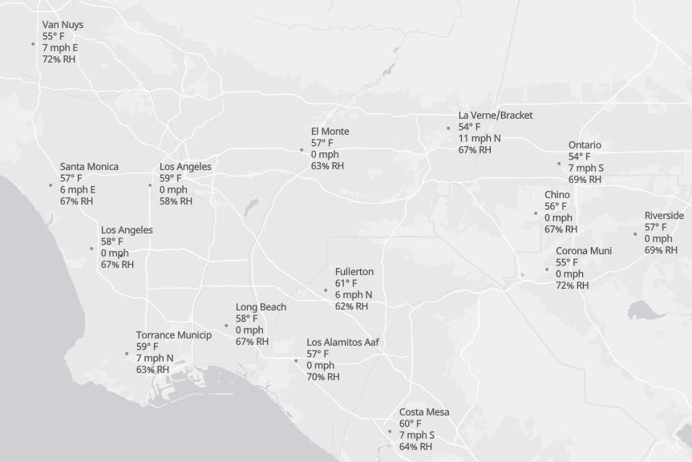
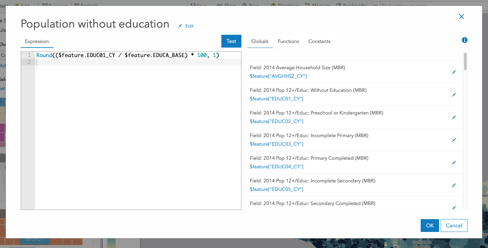
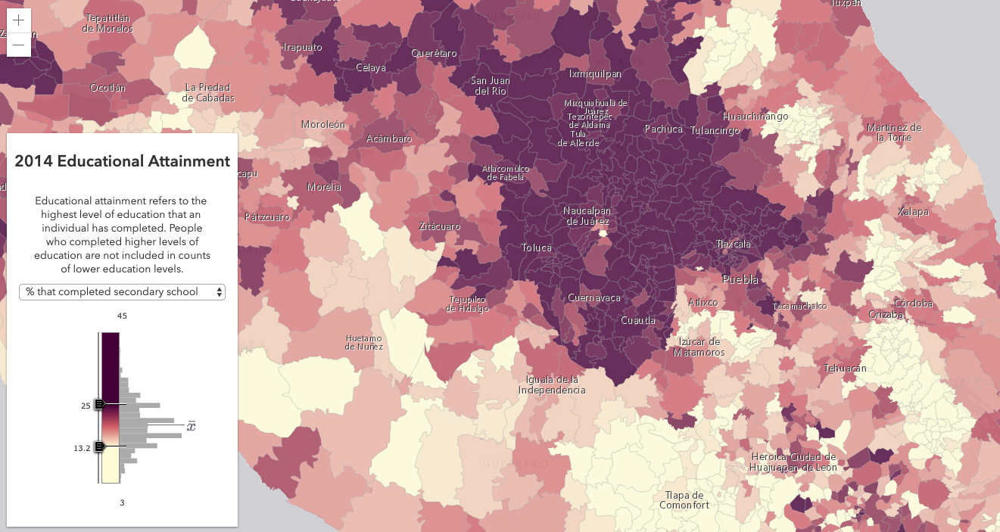
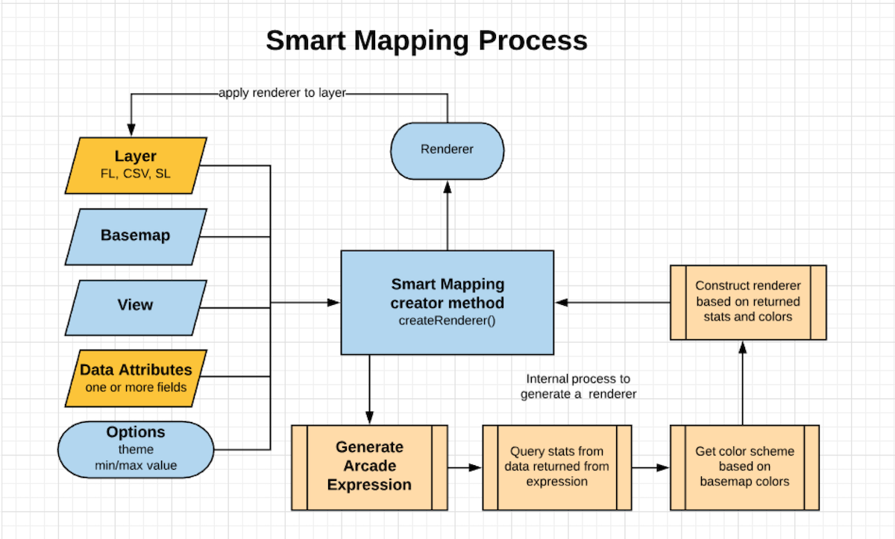
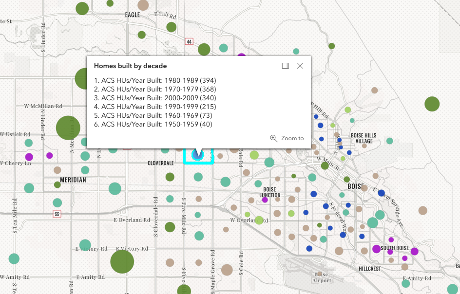

<!-- ..slide: class="title" -->

<h1 style="text-align: right; font-size: 80px;">ArcGIS API for JavaScript</h1>
<h1 style="text-align: right; font-size: 80px;">and Arcade</h1>
<h2 style="text-align: right; font-size: 40px;">Deep Dive</h2>
<p style="text-align: right; font-size: 30px;">René Rubalcava | Kristian Ekenes</p>
<p style="text-align: right; font-size: 30px;">slides: <a href="https://git.io/fjIQv"><code>https://git.io/fjIQv</code></a></p>

---

<!-- .slide: class="section" -->

## Let's talk about basemaps

---

## Basemaps

- Convenience Strings

```js
const map = new Map({
  /*
   streets, satellite, hybrid, terrain, topo, gray,
   dark-gray, oceans, national-geographic, osm,
   dark-gray-vector, gray-vector, streets-vector, topo-vector,
   streets-night-vector, streets-relief-vector, streets-navigation-vector
   */
  basemap: "streets"

  /*
   world-elevation
   */
  ground: "world-elevation"
});
```

---

## Basemaps and Ground - Custom

```js
const map = new Map({
  basemap: {
    // Layers drawn at the bottom
    baseLayers: [
      new TileLayer({ url: baselayer })
    ],
    // Layers drawn on top
    referenceLayers: [
      new TileLayer({ url: refUrl })
    ],
  },
  ground: {
    layers: [
      new ElevationLayer({ url: elevationUrl })
    ]
  }
});
```

---

## Basemap and Ground

<iframe height='500' scrolling='no' title='VT Basemaps' src='//codepen.io/odoe/embed/preview/rpQOEM/?height=300&theme-id=31222&default-tab=js,result&embed-version=2' frameborder='no' allowtransparency='true' allowfullscreen='true' style='width: 100%;'>See the Pen <a href='https://codepen.io/odoe/pen/rpQOEM/'>VT Basemaps</a> by Rene Rubalcava (<a href='https://codepen.io/odoe'>@odoe</a>) on <a href='https://codepen.io'>CodePen</a>.
</iframe>

---

## Basemaps and Ground - Portal driven

```js
  const portal = new Portal();
  portal
    .load()
    .then(() {
      // A portal can be configured to use Vector Basemaps by default or not.
      const basemap = portal.useVectorBasemaps ? portal.defaultVectorBasemap : portal.defaultBasemap;
    });

    const basemapGallery = new BasemapGallery({
      view,
      source: {
        portal,
        // Use vector no matter what
        query: portal.vectorBasemapGalleryGroupQuery
      }
    });
```

---

## View Models

 - [Custom View](https://developers.arcgis.com/javascript/latest/sample-code/sandbox/index.html?sample=widgets-frameworks-react)
 - [Use the view model](https://developers.arcgis.com/example-apps/nearby-javascript/?utm_source=github&utm_campaign=example_apps_nearby_javascript)
  - [Additional Examples](https://odoe.net/blog/view-models-in-the-arcgis-api-for-javascript/)

---

## Geocoding

```js
const locator = new Locator({ url: url });
locator.addressToLocations({
  address: {
    "singleLine": "380 New York St, Redlands, CA 92373"
  }
});
locator.locationToAddress({ location: point });
```

---

## Geocoding

```js
const searchVM = new SearchVM();
searchVM.search("380 New York St, Redlands, CA 92373");
searchVM.search(location);
```

---

## Geocoding

```js
const portal = new Portal(...);
await portal.load();
portal.helperServices.geocode.map(geocoderService => {
  // objects with details on
  // geocode services for your portal
});
```

---

## Working with Accessor

- Objects are have properties that can be:
  - read and set
  - or read-only
  - constructor arguments
  - watchable

---

### Accessor - property access

```ts
layer.opacity = 0.5;
layer.title = "My test layer";

// setting multiple values
layer.set({
  opacity: 0.5,
  title: "My test layer"
});

// accessing the value of a deep property
view.get("map.basemap.title");
view.set("map.basemap.title", "new title");
```

---

### Accessor - property watching

```ts
mapView.watch("scale", (newValue, oldValue, property, target) => {
  console.log(`scale changed: ${newValue}`);
});


mapView.watch("map.basemap.title", (newValue, oldValue, property, target) => {
  console.log(`new basemap title: ${newValue}`);
});


mapView.watch("ready, stationary", (newValue, oldValue, property, target) => {
  console.log(`property ${property}: ${newValue}`);
});

watchUtils.whenTrue(view, "stationary", () => {
  console.log("view is stationary");
})
```

[watchUtils](https://developers.arcgis.com/javascript/latest/api-reference/esri-core-watchUtils.html)

---

## Promises

---

## Promises

- All asynchronous methods return a promise, no more [events](https://developers.arcgis.com/javascript/jsapi/querytask-amd.html#events)
- The basic pattern looks like this:

```js
layer.queryFeatures(query).then(handleResult).catch(handleError);
```

---

## Promises with async/await

- work with native promises

```js
const doQuery = async (query) => {
  const results = await layer.queryFeatures(query);
  const transformedResults = results.map(transformData);
  return transformedResults;
}
```

---

## Promises

- Load resources
- Asychronously initialized `Layer`, `WebMap`, `WebScene`, `View`

---

## Promises

```js
view.when(() => {
  return view.whenLayerView(map.findLayerById("awesomeLayer"));
})
.then(layerView => {
  return watchUtils.whenFalseOnce(layerView, "updating");
})
.then(result => {
  const layerView = result.target;
  return layerView.queryFeatures();
})
.then(doSomethingWithFeatures)
.catch(errorHandler);
```

[API sample](https://developers.arcgis.com/javascript/latest/sample-code/chaining-promises/index.html)

---

## async/await

```js
const init = async (doSomethingWithFeatures) => {
  await view.when();
  const layerView = await view.whenLayerView(map.findLayerById("awesomeLayer"));
  await watchUtils.whenFalseOnce(layerView, "updating");
  const featureSet = await layerView.queryFeatures();
  doSomethingWithFeatures(featureSet);
};

try {
  init();
}
catch(error) {
  errorHandler(error);
}

```

---

## Abort Signal

- Abort requests

```js
const controller = new AbortController();
const signal = controller.signal;

esriRequest(url, { signal });

// Abort the request
signal.abort();
```

---

## [Abort Signal](./demos/abort.html)

<iframe height="500" style="width: 100%;" scrolling="no" title="Abort Controller" src="//codepen.io/odoe/embed/preview/eoYeBY/?height=500&theme-id=31222&default-tab=js,result" frameborder="no" allowtransparency="true" allowfullscreen="true">
  See the Pen <a href='https://codepen.io/odoe/pen/eoYeBY/'>Abort Controller</a> by Rene Rubalcava
  (<a href='https://codepen.io/odoe'>@odoe</a>) on <a href='https://codepen.io'>CodePen</a>.
</iframe>

---

## Patterns

---

## outFields

- Can be thought of as _additional fields_
- We determine what fields are needed for rendering, labels, and elevation in 3D
- Additional Popup fields requested as needed

---

## outFields - Feature as a [tooltip](./demos/tooltip.html)

<iframe height="500" style="width: 100%;" scrolling="no" title="FeatureView - Tooltip" src="//codepen.io/odoe/embed/preview/eoOvPj/?height=500&theme-id=31222&default-tab=js,result&editable=true" frameborder="no" allowtransparency="true" allowfullscreen="true">
  See the Pen <a href='https://codepen.io/odoe/pen/eoOvPj/'>FeatureView - Tooltip</a> by Rene Rubalcava
  (<a href='https://codepen.io/odoe'>@odoe</a>) on <a href='https://codepen.io'>CodePen</a>.
</iframe>

---

## Widgets - Architecture

 View + View Model
 

<aside class="notes"> Separate business logic and presentation. Link to doc  </aside>


---

## Loadables

- brings better control, and scheduling of loading resources.
- the views automatically loads the map and its layers

---

## Loadables

- `WebMap` / `WebScene` need to load:
 - the portal item
 - the layer module
 - the layer's item
- `MapView` / `SceneView` need to load:
 - the map
 - the layers

---

```js
  //In a single page application, get a feature from a FeatureLayer from a WebMap without displaying it, ASAP!
  const webmap = new WebMap({
    portalItem: {
      id: 'affa021c51944b5694132b2d61fe1057'
    }
  });

  webmap.load()
    .then(() => {
      return webmap.getLayer('myFeatureLayerId').load();
    })
    .then(featureLayer => {
      return featureLayer.queryFeatures({
        where: 'OBJECTID = 1'
      });
    })
    .then(result => {
      displayDetails(result.features[0]);
    })
    .otherwise(error => {
      console.error(error);
    });
```

---

## Zoom or Scale

```js
const view = new MapView({
  container: "viewDiv",
  map: map,
  center: [-116.5, 33.80],
  zoom: 14 // what does that really mean?
});
```

- Zoom = LOD (Level of Details)
- Not all LODs are created equal

---

## Zoom is not Scale

```js
const view = new MapView({
  container: "viewDiv",
  map: map,
  center: [-116.5, 33.80],
  scale: 50000 // I know what that means!
});
```

- Scale is portable
- Scale has meaning
- We still snap to closest LOD/zoom

---

## GeoJSONLayer

```js
const layer = new GeoJSONLayer({
  url: "https://raw.githubusercontent.com/ebrelsford/geojson-examples/master/nyc_council_districts.geojson",
  renderer: renderer,
  popupTemplate: popupTemplate
});

// fully editable
layer.applyEdits({ addFeatures, updateFeatures, deleteFeatures });
// queryable with statistics
cosnt query = layer.createQuery();
query.set({ where, outStatistics });
layerView.queryFeatures(query);
```

---

## Sublayer to FeatureLayer

- You can extract a FeatureLayer from MapImageLayer Sublayer
- `sublayer.createFeatureLayer()`
- Can use capabilities not normally available with Sublayer

---

## Sublayer to FeatureLayer

<iframe height='500' scrolling='no' title='createFeatureLayer' src='//codepen.io/odoe/embed/preview/PaxeyO/?height=500&theme-id=31222&default-tab=js,result&embed-version=2' frameborder='no' allowtransparency='true' allowfullscreen='true' style='width: 100%;'>See the Pen <a href='https://codepen.io/odoe/pen/PaxeyO/'>createFeatureLayer</a> by Rene Rubalcava (<a href='https://codepen.io/odoe'>@odoe</a>) on <a href='https://codepen.io'>CodePen</a>.
</iframe>

---

## createQuery

- When you can do `layer.createQuery()`
  - `query` object will already have the layers filters and layer definitions
  - more consistent
- Use `new Query()` when you don't want predefined filters to be applied

---

## createQuery

<iframe height='500' scrolling='no' title='createQuery' src='//codepen.io/odoe/embed/preview/rKQqQW/?height=500&theme-id=31222&default-tab=js,result&embed-version=2' frameborder='no' allowtransparency='true' allowfullscreen='true' style='width: 100%;'>See the Pen <a href='https://codepen.io/odoe/pen/rKQqQW/'>createQuery</a> by Rene Rubalcava (<a href='https://codepen.io/odoe'>@odoe</a>) on <a href='https://codepen.io'>CodePen</a>.
</iframe>

---

## MapImageLayer

- If you want to modify Sublayers, do it after you load the layer
- Defining them upfront overrides the defaults
  - May not be what you want

---

## MapImageLayer

<iframe height='500' scrolling='no' title='MapImageLayer - Load Sublayers' src='//codepen.io/odoe/embed/preview/WyYBwL/?height=500&theme-id=31222&default-tab=js,result&embed-version=2' frameborder='no' allowtransparency='true' allowfullscreen='true' style='width: 100%;'>See the Pen <a href='https://codepen.io/odoe/pen/WyYBwL/'>MapImageLayer - Load Sublayers</a> by Rene Rubalcava (<a href='https://codepen.io/odoe'>@odoe</a>) on <a href='https://codepen.io'>CodePen</a>.
</iframe>

---

## FeatureFilter

- Similar to definitionExpression, but on LayerView
- Works with geomtries and attribute filters
- Can define [spatial relationships](https://developers.arcgis.com/javascript/latest/api-reference/esri-views-layers-support-FeatureFilter.html#spatialRelationship)
- [demo](./demos/filter.html)

---

## FeatureEffect

- For emphasizing/deemphasizing results of a filter
- Uses [CSS Filters](https://developer.mozilla.org/en-US/docs/Web/CSS/filter)
- `includedEffect` and/or `excludedEffect`
- [demo](./demos/effect.html)

---

## Filter and Effect

<iframe height="500" style="width: 100%;" scrolling="no" title="FilterEffects" src="//codepen.io/odoe/embed/preview/GeoKLB/?height=500&theme-id=31222&default-tab=html,result&editable=true" frameborder="no" allowtransparency="true" allowfullscreen="true">
  See the Pen <a href='https://codepen.io/odoe/pen/GeoKLB/'>FilterEffects</a> by Rene Rubalcava
  (<a href='https://codepen.io/odoe'>@odoe</a>) on <a href='https://codepen.io'>CodePen</a>.
</iframe>

---

## Service Workers

- Used for controlling cache capabilities when building a PWA
- Also useful for notifications
- [demo app](https://arcgis-jsapi-sw.surge.sh/) | [edit app](https://developers.arcgis.com/javascript/latest/sample-code/sandbox/index.html?sample=editing-applyedits)

---

# Arcade

---

## Why Arcade?

- Client-side calculation
  - Frequently updated datasets/layers
  - Calculate data from layers you don't own
  - Algorithms not well defined
- Persists across the platform
  - Secure
  - Runs on all supported devices/apps (desktop/mobile/web)
- Lightweight
- Geospatial functions are first class members

---

## Normalization for rendering

```js
const renderer = {
  type: "simple", // autocasts as new SimpleRenderer()
  symbol: defaultSym,
  label: "U.S. County",
  visualVariables: [{
    type: "color",
    valueExpression: "($feature.POP_POVERTY / $feature.TOTPOP_CY ) * 100",
    legendOptions: {
      title: "% population in poverty by county"
    },
    stops: [
      { value: 10, color: "#FFFCD4" },
      { value: 30, color: "#350242" }
    ]
  }]
};
```

---

## Normalization for rendering

<iframe height='500' scrolling='no' title='Data-driven color' src='//codepen.io/kekenes/embed/preview/eopYPa/?height=500&theme-id=31222&default-tab=html,result&embed-version=2' frameborder='no' allowtransparency='true' allowfullscreen='true' style='width: 100%;'>See the Pen <a href='https://codepen.io/kekenes/pen/eopYPa/'>Data-driven color</a> by Kristian Ekenes (<a href='https://codepen.io/kekenes'>@kekenes</a>) on <a href='https://codepen.io'>CodePen</a>.
</iframe>

---

## Arcade in script

```html
<script type="text/arcgis-arcade" id="wind-direction">
  var DEG = $feature.WIND_DIRECT;
  var SPEED = $feature.WIND_SPEED;
  var DIR = When( SPEED == 0, "",
    (DEG < 22.5 && DEG >= 0) || DEG > 337.5, "N",
    DEG >= 22.5 && DEG < 67.5, "NE",
    DEG >= 67.5 && DEG < 112.5, "E",
    DEG >= 112.5 && DEG < 157.5, "SE",
    DEG >= 157.5 && DEG < 202.5, "S",
    DEG >= 202.5 && DEG < 247.5, "SW",
    DEG >= 247.5 && DEG < 292.5, "W",
    DEG >= 292.5 && DEG < 337.5, "NW", "" );
  return SPEED + " mph " + DIR;
</script>
```

```js
const windArcade = document.getElementById("wind-direction").text;

const windClass = {
  labelExpressionInfo: {
    expression: windArcade
  },
  labelPlacement: "above-right",
  symbol: createTextSymbol("#3ba53f")
};
```

---

## Arcade in script

[](https://developers.arcgis.com/javascript/latest/sample-code/labels-multiline/index.html)

---

90% of the time, you'll author Arcade expressions in the ArcGIS Online Arcade editor...

---



---

## Generating Arcade in behalf of your users

```js
function generateArcade(fields: string[], normalizationField?: string): string {
  const value = fields.map( field => `$feature.${field}` ).reduce( (a,c) => `${a} + ${c}`);
  const percentValue = normalizationField ? `( ( ${value} ) / $feature.${normalizationField} ) * 100` : value;
  return `Round( ${percentValue} )`;
}
```

[](https://ekenes.github.io/conferences/ds-2019/arcade/demos/generate-arcade/)

---

## Generating Arcade in behalf of your users

[](https://www.esri.com/arcgis-blog/products/js-api-arcgis/mapping/generating-arcade-expressions-what-smart-mapping-does-for-you/)

---

- [Relationship](https://www.esri.com/arcgis-blog/products/js-api-arcgis/mapping/smart-mapping-with-arcade-exploring-relationships/)
- [Predominance](https://www.esri.com/arcgis-blog/products/js-api-arcgis/mapping/smart-mapping-with-arcade-visualizing-predominance/)
- [Age](https://www.esri.com/arcgis-blog/products/js-api-arcgis/mapping/smart-mapping-with-arcade-exploring-age/)

---

## Generate Arcade for popups

[](https://ekenes.github.io/esri-ts-samples/visualization/smart-mapping/predominance/popup-template/?id=e1f194d5f3184402a8a39b60b44693f4)

---

## Expression Sharing

https://github.com/Esri/arcade-expressions/

---

<!-- .slide: class="end" -->
